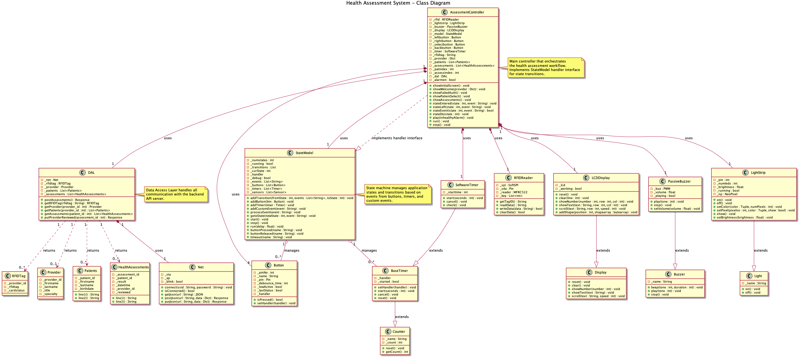
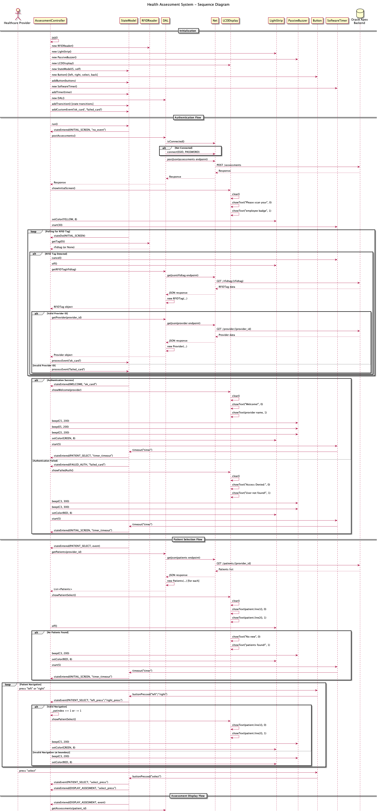
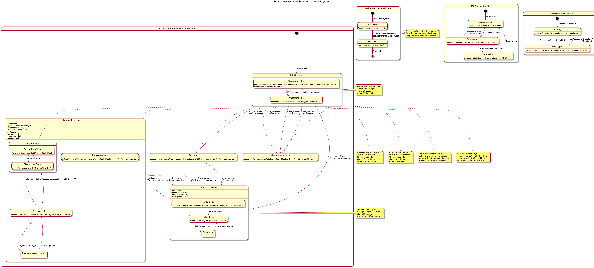
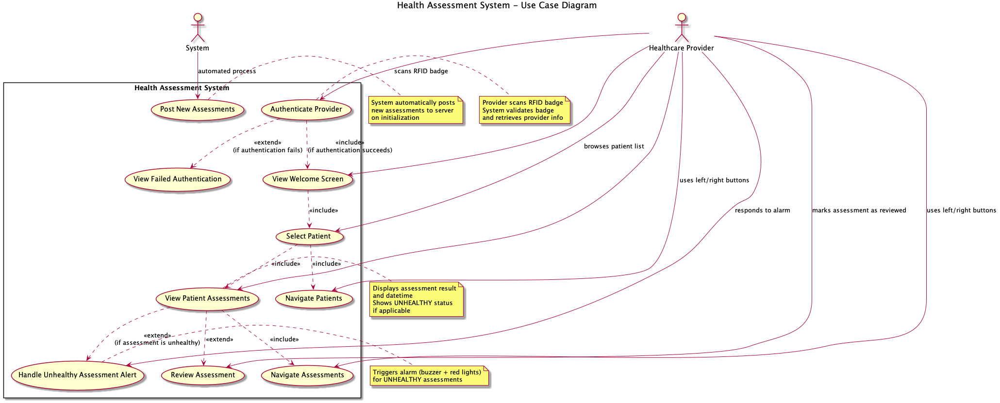

# PiHealth Monitoring System

A HIPAA-compliant* remote patient monitoring system that enables healthcare providers to securely access and review patient health assessments based on vital signs data collected through an Oracle Apex front-end application.

**Group Project for ISM6106 Systems Design Course - Florida International University**

## Overview

The PiHealth Monitoring System is a secure, remote monitoring solution that allows healthcare providers to access patient health assessments in a HIPAA-compliant* manner. Patient vital signs are inputted through an Oracle Apex web application front-end, and assessments are automatically generated based on predefined health thresholds. If 3 or more vital signs fall outside the expected normal range, the patient is recorded as "UNHEALTHY"; otherwise, the assessment result is "HEALTHY". These assessment results are stored in the database and presented to providers through the monitoring system. Healthcare providers can then remotely access these assessments through a physical computing device that connects to the Oracle Apex backend via REST API.

## Key Features

- **HIPAA-Compliant* Remote Access**: Secure, encrypted communication between the monitoring device and Oracle Apex backend
- **RFID-Based Provider Authentication**: Secure provider identification using RFID badge scanning for access control and audit trails
- **Real-Time Assessment Display**: Physical computing device displays patient assessments in real-time as they are generated
- **Provider-Patient Assignment**: Providers can view only their assigned patients and their corresponding health assessments
- **Assessment Review Workflow**: Providers can mark assessments as reviewed, ensuring proper documentation and follow-up
- **Visual and Audio Alerts**: LED light strip and buzzer provide immediate feedback for unhealthy assessments
- **State-Based User Interface**: Intuitive navigation using buttons and LCD display for viewing patients and assessments

## System Architecture

### Front-End (Oracle Apex)
- Web-based interface for entering patient vital signs: Temperature, Heart Rate, Glucose, Oxygen Saturation, Systolic Blood Pressure, Diastolic Blood Pressure, and Respiratory Rate
- Automatic health assessment generation based on vital sign thresholds
- **Assessment Logic**: If 3 or more vital signs fall outside the expected normal range, the assessment is recorded as "UNHEALTHY"; otherwise, it is recorded as "HEALTHY"
- Secure REST API endpoints for data access

### Backend (Oracle Apex REST API)
The system integrates with Oracle Apex REST API endpoints:
- `provider/` - Provider information retrieval
- `patients/` - Patient data by provider
- `rfidtag/` - RFID tag authentication
- `assessments` - Health assessment data
- `provider_reviewed/` - Mark assessments as reviewed

### Physical Computing Device (Raspberry Pi Pico)
A physical monitoring device that:
- Authenticates providers via RFID badge scanning
- Retrieves patient and assessment data from Oracle Apex backend
- Displays information on LCD screen
- Provides visual (LED strip) and audio (buzzer) feedback
- Allows navigation through patients and assessments using physical buttons

## System Diagrams

### Class Diagram

### Sequence Diagram

### State Diagram

### Use Case Diagram

## Assessment Logic

The system automatically evaluates patient health status based on vital sign measurements:

- **Vital Signs Monitored**: 
  - Temperature
  - Heart Rate
  - Glucose
  - Oxygen Saturation (Oxygen Sat)
  - Systolic Blood Pressure
  - Diastolic Blood Pressure
  - Respiratory Rate
- **Assessment Criteria**: 
  - If **3 or more** vital signs fall outside the expected normal range → Assessment result: **"UNHEALTHY"**
  - If **fewer than 3** vital signs are outside normal range → Assessment result: **"HEALTHY"**
- **Database Storage**: Assessment results are stored in the database with timestamps and linked to the corresponding patient and provider
- **Provider Notification**: Unhealthy assessments trigger visual (red LED) and audio (buzzer) alerts on the monitoring device to draw immediate attention

## Project Structure

### Group-Written Files
The following files were developed by the project team:

- **`main.py`**: Application entry point that initializes and runs the AssessmentController
- **`AssessmentController.py`**: Main controller implementing the state machine for user interaction, RFID authentication, patient selection, and assessment display
- **`modelclasses.py`**: Data model classes including `RFIDTag`, `Provider`, `Patients`, and `HealthAssessments`
- **`DAL.py`**: Data Access Layer handling all REST API communications with the Oracle Apex backend

### Instructor-Provided Files
The following files and libraries were provided by the course instructor:

- `Button.py` - Button input handling
- `Buzzer.py` - Audio feedback control
- `LightStrip.py` - LED strip control
- `Displays.py` - LCD display management
- `RFIDReader.py` - RFID tag reading functionality
- `StateModel.py` - State machine framework
- `Counters.py` - Timer and counter utilities
- `Log.py` - Logging functionality
- `Net.py` - Network connectivity and HTTP client
- `Sensors.py` - Sensor interface classes
- `gpio_lcd.py`, `lcd_api.py`, `pico_i2c_lcd.py` - LCD display drivers
- `mfrc522.py` - RFID reader library
- `mpu6050.py` - Motion sensor library
- `secrets.py` - Network credentials (WiFi SSID and password)

## System Workflow

1. **Provider Authentication**: Provider scans RFID badge at the monitoring device
2. **Authentication Verification**: System validates RFID tag against Oracle Apex backend
3. **Patient Retrieval**: System fetches assigned patients for the authenticated provider
4. **Patient Selection**: Provider navigates through assigned patients using left/right buttons
5. **Assessment Display**: Provider views health assessments for selected patient
6. **Assessment Review**: Provider marks assessments as reviewed, updating the backend database
7. **Alert System**: Unhealthy assessments trigger visual (red LED) and audio (buzzer) alarms

## State Machine

The system operates using a state-based model with the following states:

- **INITIAL_SCREEN**: Waiting for RFID badge scan
- **WELCOME**: Displaying authenticated provider information
- **FAILED_AUTH**: Displaying authentication failure message
- **PATIENT_SELECT**: Browsing assigned patients
- **DISPLAY_ASSESSMENT**: Viewing patient health assessments

## Hardware Components

- **Raspberry Pi Pico**: Main microcontroller
- **RFID Reader (MFRC522)**: Provider badge authentication
- **LCD Display (I2C)**: Patient and assessment information display
- **LED Light Strip**: Visual status indicators (green/yellow/red)
- **Passive Buzzer**: Audio feedback and alarm system
- **Physical Buttons**: Navigation controls (left, right, select, back)

## Security & Compliance

- **HIPAA Compliance***: Secure data transmission and access controls
- **Provider Authentication**: RFID-based authentication ensures only authorized personnel can access patient data
- **Audit Trail**: All provider actions are logged and tracked
- **Secure Network Communication**: Encrypted HTTPS communication with Oracle Apex backend

\* **Disclaimer**: This project is for demonstration and educational purposes only. While the system implements security features and access controls, it is not actually HIPAA-compliant and should not be used in a production healthcare environment. Real HIPAA compliance requires comprehensive security audits, formal compliance certifications, and adherence to all applicable regulations and standards.

## Use Cases

- Remote patient monitoring for healthcare providers
- Real-time access to patient health assessments
- Provider workflow management for reviewing patient assessments
- Alert system for critical health status changes
- Secure, compliant access to patient health data

## Course Information

**Course**: ISM6106 Systems Design  
**Institution**: Florida International University  
**Project Type**: Group Project

